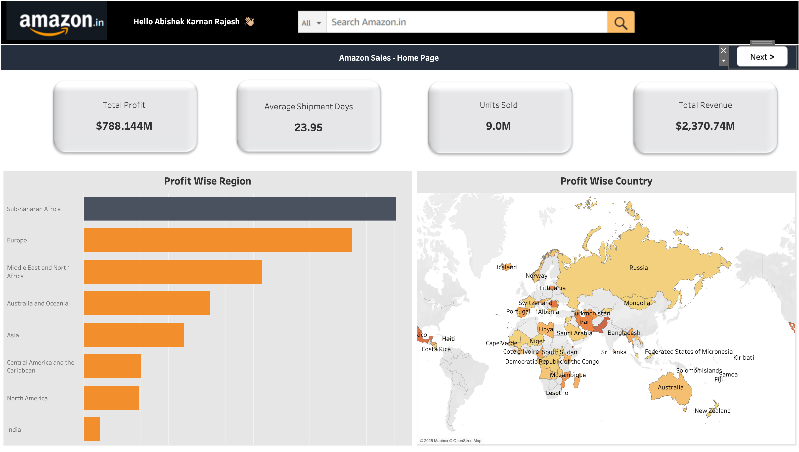
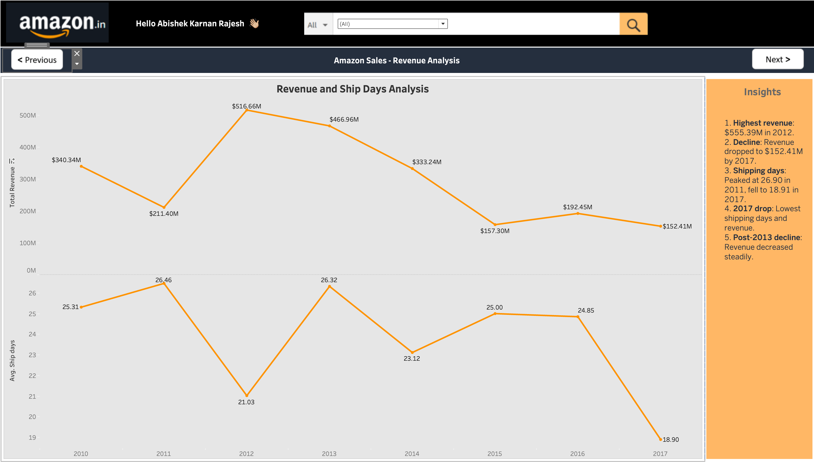
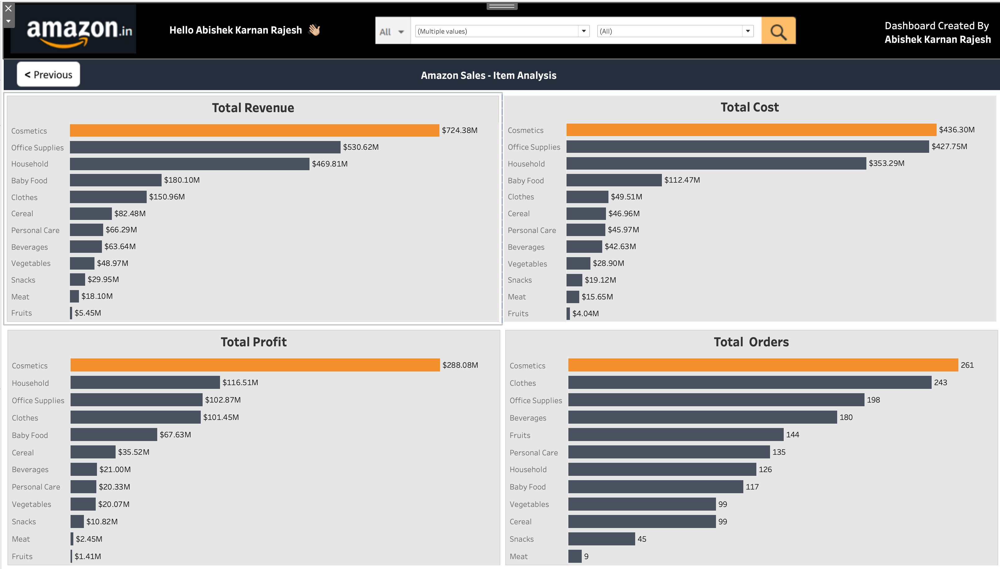
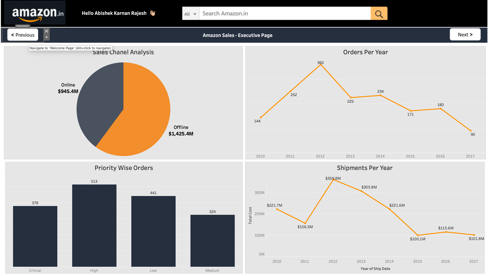
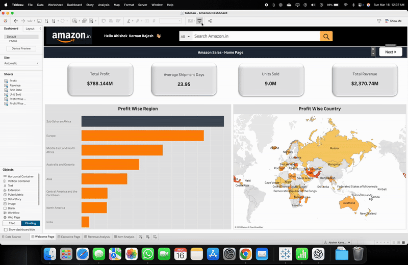

# 📊 Amazon Sales Dashboard - Data Analysis & Visualization

## 🚀 Project Overview
This project analyzes **Amazon's sales data** using **Tableau** to uncover key business insights, including revenue trends, shipping efficiency, regional profitability, and product performance.

## 🔥 Key Insights
- **Total Revenue**: $2.37B 💰
- **Total Profit**: $788.14M
- **Units Sold**: 9M 🛍️
- **Most Profitable Region**: **Sub-Saharan Africa** 🌍
- **Most Profitable Product**: **Cosmetics** - $288.08M 💄
- **Online vs Offline Sales**: 
  - **Offline**: $1.42B
  - **Online**: $945.4M
- **Peak Revenue Year**: **2012 ($555.39M)** 📈
- **Declining Trend Post-2013**: Revenue steadily decreased over time.
- **Shipping Efficiency**: Shipping days varied, dropping significantly in 2017.

## 📊 Dashboard Highlights
The dashboard consists of multiple pages focusing on different aspects of Amazon's sales data:

### 🖼️ **Dashboard Preview**
#### 1️⃣ Welcome Page

#### 2️⃣ Executive Page

#### 3️⃣ Revenue Analysis

#### 4️⃣ Item Analysis

## 🎥 Demo Video
📽️ **Check out the dashboard in action:**  

## 📂 Dataset
The dataset used for this project contains:
- Order details (units sold, revenue, cost, profit, etc.)
- Shipment information (average shipping days, shipment costs)
- Regional and product-wise sales breakdown

## 🛠️ Tools Used
- **Tableau** - Data visualization & dashboard design
- **Python/Pandas (optional)** - Data preprocessing (if applicable)
- **Excel/CSV** - Data source format

## 📌 How to Use
1. Download the dataset (if provided in the repository).
2. Open the Tableau workbook (.twbx) to explore the dashboard.
3. Interact with filters, visualizations, and insights.

## 📢 Connect with Me
💡 **Have insights or feedback? Let’s discuss!**
- **LinkedIn**: [Abishek Karnan Rajesh](https://www.linkedin.com/in/abishekrajesh/)  
- **GitHub**: [Your GitHub Profile]  

📊 **If you find this useful, give it a ⭐ and share your thoughts!**

#Tableau #DataAnalytics #AmazonSales #BusinessIntelligence #DataVisualization #Ecommerce #DashboardDesign
